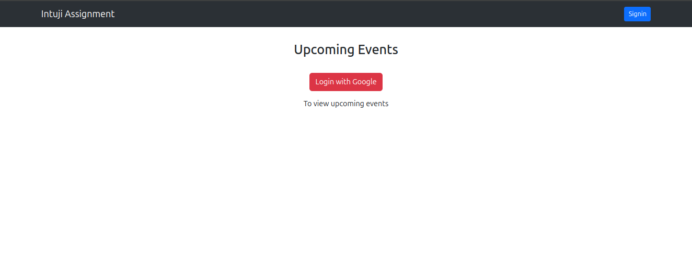
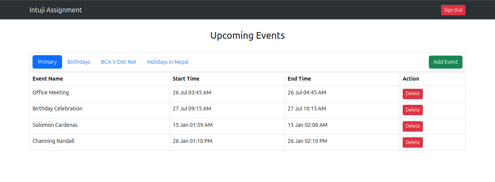
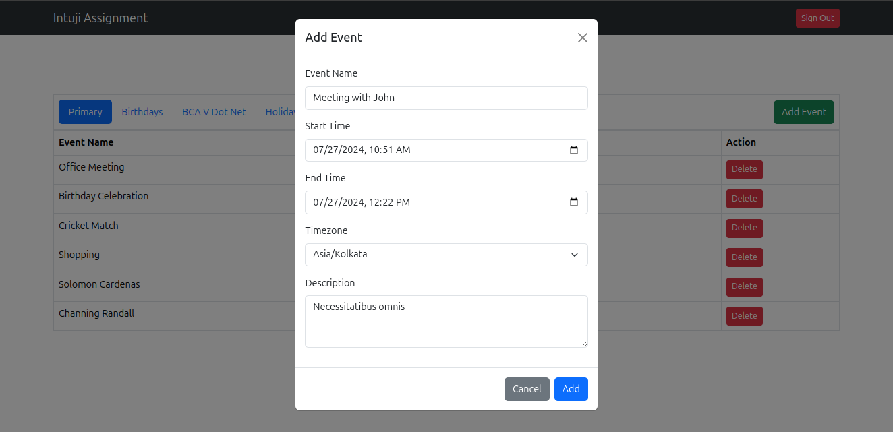
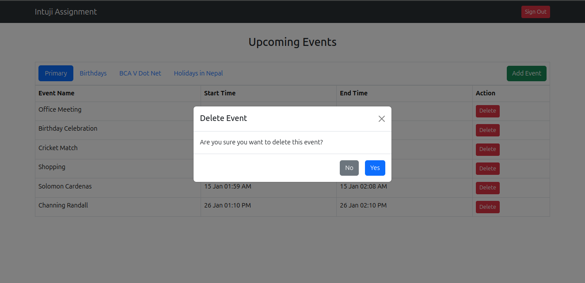

## Steps to Setup the Project
1. Clone the repository
```bash
git clone repo-url
```
2. Copy the .env.example file to .env
```bash
cp .env.example .env
```
3. Get necessary credentials from google cloud console and update the .env file
```bash
GOOGLE_CLIENT_ID=your-google-client-id
GOOGLE_CLIENT_SECRET=your-google-client-secret
GOOGLE_REDIRECT_URI=your-google-redirect-uri
```
4. Install the dependencies
```bash
composer install
```
5. Run php server
```bash
php -S localhost:8000
```
6. Visit the application in your browser
```bash
http://localhost:8000
```
7. You can now login with google account and start managing events

## Screenshots
1. Home Page (Without Login)


2. Home Page (Logged In)


3. Create Event


4. Delete Event
